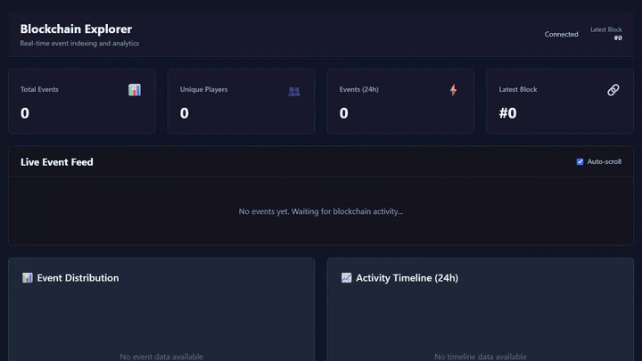

# Blockchain Explorer



*The dashboard running against a local Docker stack that the repo's own `generate-events` script seeds (79 events in about 20 seconds), recorded with Playwright and sped up 1.25x. The feed updates per event and the counters every 10 seconds; the charts, leaderboard and explorer load when the page does, so the clip refreshes the page once after seeding (the wait for the backend cache to expire is cut out).*

An event indexer and analytics dashboard for its own `GameState` contract (players joining, score updates, item purchases, game resets). It is not a general block and transaction explorer for arbitrary chains. A Node.js and Express backend polls a Hardhat chain for the events of a small game contract, batches them into PostgreSQL, serves aggregated stats over REST and pushes new events to a React dashboard over WebSocket. It is a portfolio project that runs locally in Docker. There is no hosted demo, and the `docker-compose.prod.yml`, Nginx config and CI workflows describe how it could be deployed, not a deployment that exists.

## What it does

- Polls the chain and indexes contract events into PostgreSQL, in batches of 50 with a 1 second flush
- Serves 8 REST endpoints with pagination and filtering: events, stats, a leaderboard, an event-type distribution and an activity timeline
- Pushes `newEvent`, `statsUpdate` and `blockUpdate` messages over a single shared Socket.IO connection
- Caches aggregate queries in memory with a TTL (5 to 60 seconds, set per query)
- Reports the health of the database, chain connection, event listener, WebSocket server and cache on `/health`
- Retries database and blockchain calls with exponential backoff and shuts down gracefully
- Shows the events and stats in a React 19 dashboard with Recharts: stats cards, a live event feed, charts, a leaderboard and an event explorer with filters
- Includes Docker Compose files, ten PowerShell helper scripts and two GitHub Actions workflows (`ci.yml`, `deploy.yml`)

## Tech stack

| Layer | Technology |
|-------|------------|
| Frontend | React 19, TypeScript 5.7, Vite 7.1, Tailwind CSS 4.1, Recharts 3.2, Socket.IO client 4.8 |
| Backend | Node.js 22, Express 5.1, TypeScript 5.7, Socket.IO 4.8, ethers.js 6.15 |
| Database | PostgreSQL 18, pg 8.13 |
| Blockchain | Hardhat 3.0, Solidity 0.8.28 |
| DevOps | Docker, Docker Compose v2 |

## Quick start

You need Docker Desktop (or Docker with Compose) and Node.js. No wallet or API key is involved: the chain is a local Hardhat node inside Docker.

### Automated setup

On Windows PowerShell:

```powershell
git clone https://github.com/Exalt24/Blockchain-Explorer.git
cd Blockchain-Explorer

.\scripts\setup.ps1

Start-Process http://localhost:3000
```

The script installs the dependencies, builds and starts the four containers, runs the migrations, deploys the contract, restarts the backend and offers to generate the test events. I ran it end to end on Windows PowerShell 5.1 with Docker Desktop. I have not run the other nine helper scripts.

### Manual Docker setup

```bash
# 1. Start all services
docker-compose up -d

# 2. Run database migrations
docker-compose exec backend npm run migrate

# 3. Deploy smart contracts
docker-compose exec hardhat npm run deploy-docker

# 4. Restart backend
docker-compose restart backend

# 5. Generate test events (optional)
docker-compose exec hardhat npm run generate-events
```

The generator sends 79 events (10 PlayerJoined, 65 ScoreUpdated, 3 ItemPurchased, 1 GameReset) in about 20 seconds. The dashboard then shows `Total Events` 79, `Unique Players` 10 and `Latest Block` #70.

- Frontend: http://localhost:3000
- Backend API: http://localhost:4000/api
- Health check: http://localhost:4000/health
- Hardhat RPC: http://localhost:8545

If one of those host ports is already taken, change the left-hand side of its `ports:` entry in `docker-compose.yml`. Moving the backend also means pointing `VITE_API_URL` and `VITE_WS_URL` in `frontend/.env.docker` at the new port, because the browser calls the backend directly.

The stats cards refresh every 10 seconds and the live feed updates per event, but the charts, the leaderboard and the explorer fetch once when the page loads. Reload after seeding. The backend caches the leaderboard for 30 seconds and the charts for 60, so a reload inside that window can still show the old numbers.

## Project structure

```
blockchain-explorer/
├── backend/              # Node.js/Express backend
│   ├── src/
│   │   ├── api/          # REST API routes
│   │   ├── config/       # Configuration files
│   │   ├── services/     # Event processing, stats, cache, health, listener
│   │   ├── types/        # TypeScript types
│   │   ├── utils/        # Batch processor, retry, throttle
│   │   └── websocket/    # WebSocket server
│   ├── migrations/       # Database migrations
│   └── tests/            # unit, integration and performance scripts
├── contracts/            # Smart contracts
│   ├── contracts/        # Solidity files
│   ├── ignition/         # Deployment scripts
│   ├── scripts/          # Helper scripts
│   └── test/             # Contract tests
├── frontend/             # React frontend
│   ├── src/
│   │   ├── components/   # React components
│   │   ├── contexts/     # Context providers
│   │   ├── hooks/        # Custom hooks
│   │   ├── services/     # API services
│   │   └── types/        # TypeScript types
│   └── nginx.conf        # Nginx config for the production frontend image
├── docker/               # Dockerfiles
├── scripts/              # PowerShell automation scripts (10)
├── docs/                 # API, ARCHITECTURE, DEPLOYMENT, TESTING, TROUBLESHOOTING, MONITORING, PRODUCTION-CHECKLIST
├── .github/workflows/    # ci.yml, deploy.yml
├── docker-compose.yml        # Development environment
├── docker-compose.prod.yml   # Production-style environment
├── CHANGELOG.md
└── README.md
```

## Documentation

- [API reference](docs/API.md)
- [Architecture](docs/ARCHITECTURE.md)
- [Deployment](docs/DEPLOYMENT.md)
- [Testing](docs/TESTING.md)
- [Monitoring](docs/MONITORING.md)
- [Troubleshooting](docs/TROUBLESHOOTING.md)
- [Production checklist](docs/PRODUCTION-CHECKLIST.md)

## Development scripts

```powershell
.\scripts\setup.ps1              # first-time setup
.\scripts\start-dev.ps1          # start all services
.\scripts\stop-dev.ps1           # stop services (keeps data)
.\scripts\reset-all.ps1          # full reset (destroys data)

.\scripts\deploy-contract.ps1    # deploy the smart contract
.\scripts\generate-events.ps1    # generate test events
.\scripts\health-check.ps1       # system health check
.\scripts\view-logs.ps1          # view service logs
.\scripts\run-tests.ps1          # run test suites
.\scripts\db-operations.ps1      # database management
```

See [DEPLOYMENT.md](docs/DEPLOYMENT.md#development-scripts-powershell-automation) for what each script does.

## API reference

### REST endpoints

```bash
GET  /api/events                # list events (paginated, filterable)
GET  /api/events/tx/:hash       # events by transaction
GET  /api/events/block/:block   # events by block
GET  /api/stats                 # platform statistics
GET  /api/leaderboard           # player rankings
GET  /api/stats/distribution    # event type breakdown
GET  /api/stats/timeline        # activity over time
GET  /health                    # system health
```

### WebSocket events

```javascript
// Client to server
socket.emit('ping');            // the server answers with 'pong'

// Server to client
socket.on('newEvent', (event) => { /* ... */ });
socket.on('statsUpdate', (stats) => { /* ... */ });
socket.on('blockUpdate', (block) => { /* ... */ });
```

See [API.md](docs/API.md) for the details.

## Testing

The repo has 16 contract tests, a set of runnable backend test scripts and a handful of integration and performance scripts. The backend `npm test` runs only the two unit scripts that need no database or chain (cache and batch processor). The other scripts are individual `tsx` programs that print their results. The integration and performance ones need the stack running, and there is no single test-runner total for them.

### Contract tests

```bash
cd contracts
npm install
npm test
```

This runs the 16 tests in `contracts/test/`.

### Backend scripts

```bash
cd backend
npm test                 # cache and batch processor unit scripts, no services needed

npm run diagnose-api     # quick API smoke test, needs the backend running

# Unit scripts
npm run test:health      # health monitor
npm run test:cache       # cache service
npm run test:batch       # batch processor

# Integration scripts (need the stack running)
npm run test:e2e
npm run test:api-integration
npm run test:concurrent
npm run test:ws-stress

# Performance scripts (need the stack running)
npm run test:load
npm run test:cache-perf  # takes several minutes because it waits out each cache TTL
```

I have not published latency, throughput or cache hit-rate numbers because I have not recorded a run of `test:load` or `test:cache-perf`. See [TESTING.md](docs/TESTING.md) for what each script checks.

## Deployment

### Development (Docker)

```bash
docker-compose up -d
docker-compose down
```

### Production-style Docker

```bash
cp backend/.env.production.docker backend/.env
nano backend/.env

docker-compose -f docker-compose.prod.yml up -d
```

### PM2 and Nginx

```bash
sudo apt update && sudo apt upgrade -y
curl -fsSL https://deb.nodesource.com/setup_22.x | sudo -E bash -
sudo apt install -y nodejs postgresql-18 nginx

git clone https://github.com/Exalt24/Blockchain-Explorer.git /opt/blockchain-explorer
cd /opt/blockchain-explorer
npm run setup

cd backend
npm install --production
npm run build
pm2 start ecosystem.config.js --env production
pm2 save

sudo certbot --nginx -d yourdomain.com
```

These are the steps the deployment guide describes. I have run the Docker setup locally and have not carried out the server install above. See [DEPLOYMENT.md](docs/DEPLOYMENT.md).

## How it is built

### Data path

```
Frontend (React 19)
        | HTTP and WebSocket
Backend (Node.js + Express 5)
        |
   Services: EventProcessor, Stats, Cache, HealthMonitor
        |
   PostgreSQL

Backend <-- ethers.js --> Blockchain (Hardhat)
```

See [ARCHITECTURE.md](docs/ARCHITECTURE.md).

### Choices that are in the code

- The PostgreSQL pool is capped at 20 connections.
- Events are inserted in batches of 50, flushed every second, so a burst becomes a few transactions instead of one per event.
- Block updates over WebSocket are throttled to one per second.
- Cached queries use TTLs of 5 seconds (stats), 30 seconds (leaderboard) and 60 seconds (distribution and timeline). The cache is a `Map` with TTL expiry and a cleanup timer, with no size limit or LRU eviction.
- The event listener polls instead of subscribing, because Hardhat 3 did not work with `contract.on()`. The CHANGELOG lists that and the other problems I hit.

## Monitoring

```bash
curl http://localhost:4000/health
```

The response reports `status` plus the state of the `database`, `blockchain`, `eventListener`, `websocket` and `cache` services. See [MONITORING.md](docs/MONITORING.md) for the monitoring setup it describes.

## Troubleshooting

**Backend will not start:**
```bash
netstat -ano | findstr :4000
rm -rf node_modules && npm install
cat .env
```

**Database connection failed:**
```bash
docker-compose ps postgres
docker-compose restart postgres
psql -h localhost -U postgres -d blockchain_explorer
```

**No events indexed:**
```bash
docker-compose exec hardhat npm run deploy-docker
docker-compose restart backend
docker-compose exec hardhat npm run generate-events
curl http://localhost:4000/health | jq '.services.eventListener'
grep CONTRACT_ADDRESS backend/.env.docker
```

See [TROUBLESHOOTING.md](docs/TROUBLESHOOTING.md).

## Not done

- No hosted demo and no real deployment
- No rate limiting on the API
- No measured performance numbers
- The charts, leaderboard and explorer do not refresh on their own; only the feed and the stats cards do
- The feed's relative times can read negative on the local chain (for example `-24s ago`) because the Hardhat block timestamps and the browser clock do not line up; I have not changed that
- I have run the Docker setup and the automated `setup.ps1` on Windows only, and none of the production-style steps
- Redis for a shared cache, Prometheus metrics, Grafana dashboards, GraphQL and multi-chain support are planned and not built

## Contributing

Fork the repository, create a branch, commit, push and open a pull request. Follow the existing code style, add tests for new features and update the docs.

## License

MIT. See [LICENSE](LICENSE).
